# project_full

# 1. Database

# 2. Interface and functionality 

## 2.1 Login Page
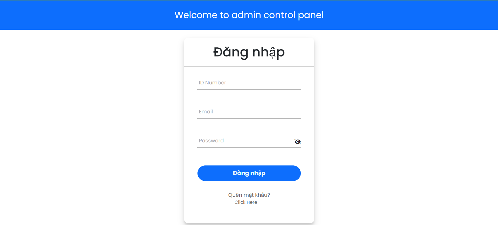

## 2.2 Subjects Management Page
#### Here, teachers can create many subjects that they teach.
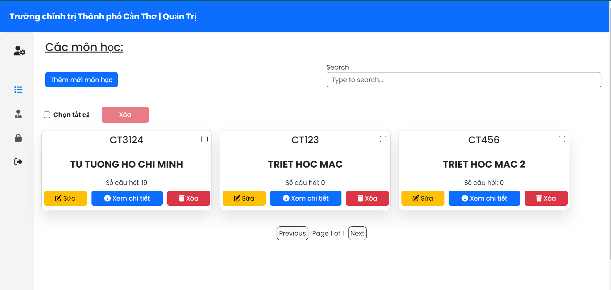

## 2.3 Subject Question Management Page
#### Here, instructors can add new questions (2.4), create topics and add questions using a word question file.
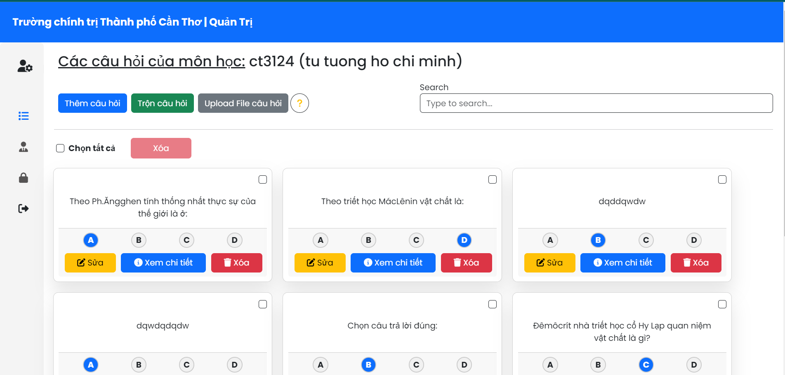

## 2.4 Add Question Page
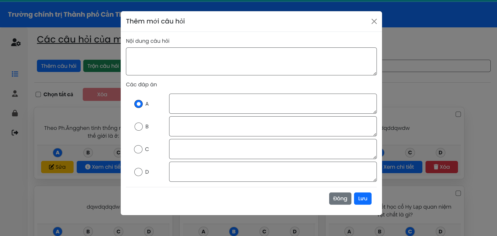

## 2.5 Exam Creation Page
#### Here, instructors can create an exam with the number of questions entered, export the exam to a Word file with exam code 101. After each "start," the exam code will increase by 1, and the answers to the questions will be saved in a sheet of an Excel file, details below.
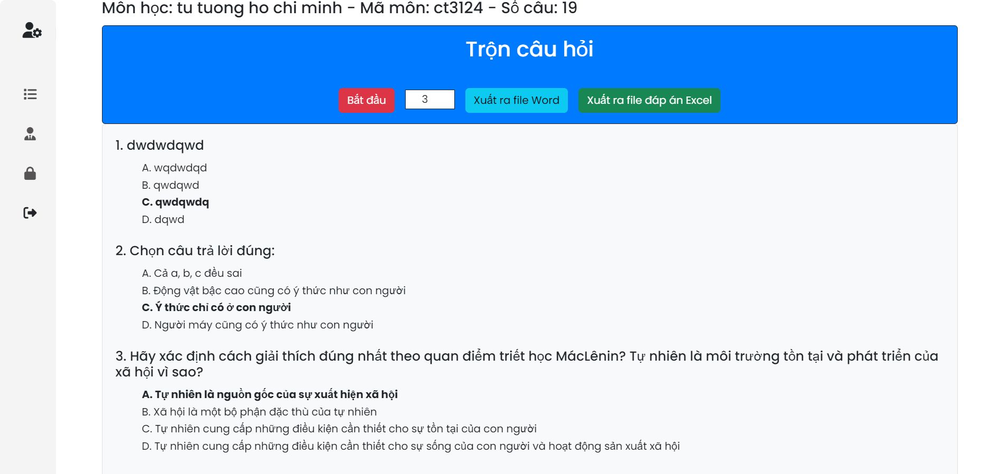

## 2.6 Export The Exam To A Word File ( Test 101 )
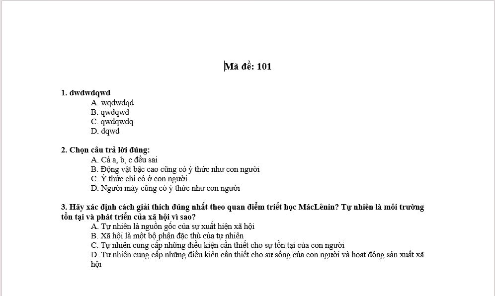

## 2.7 Export The Exam To A Word File ( Test 102 )
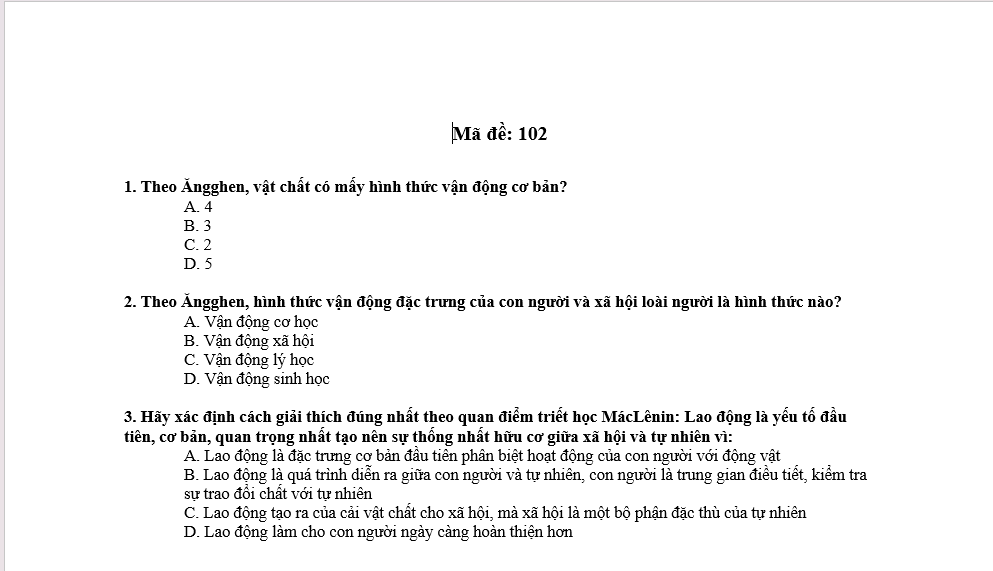

## 2.8 Export The Answers To The Sheets In An Excel File ( Test 101 )
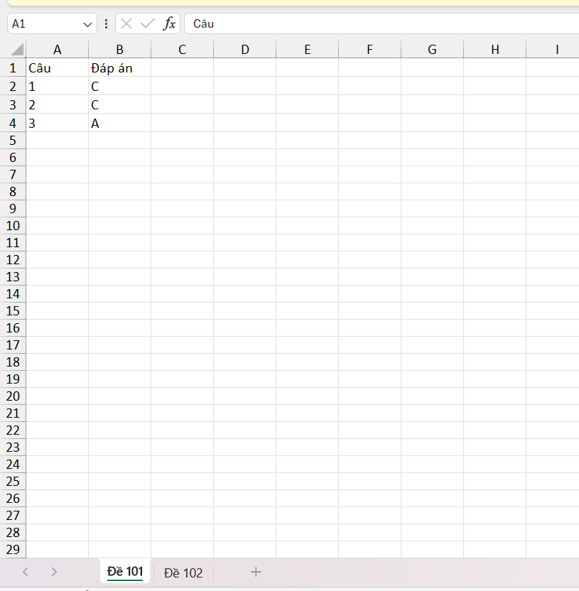

## 2.9 Export The Answers To The Sheets In An Excel File ( Test 102 )
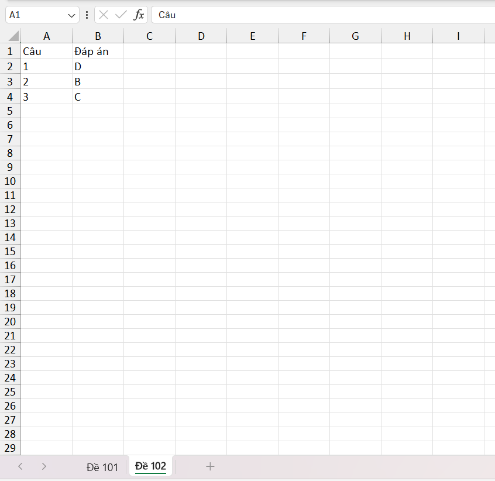

## 2.10 Password Change Page
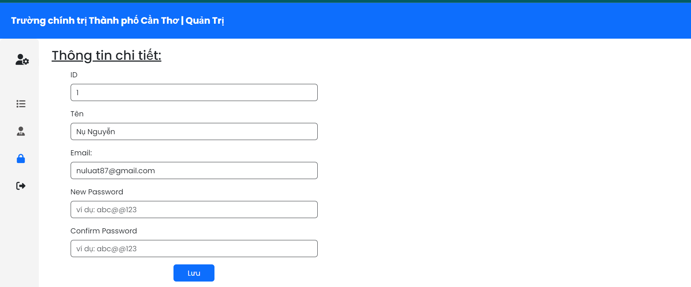
#### The system sends an email with a link to the password change page
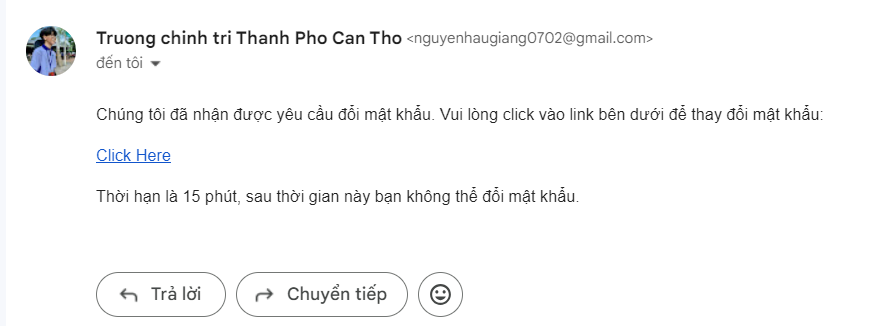
#### After clicking
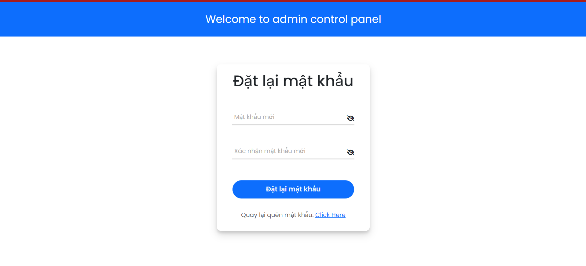

# 3. The Specific Functions Of An Account With The Admin Role

## 3.1 Manage Other Accounts
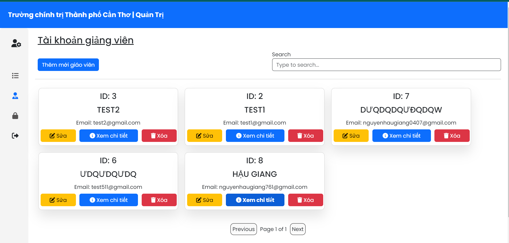

## 3.1 Add A New Account
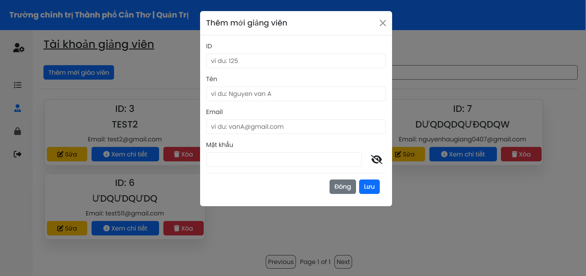
#### Send a notification to the registered email including the name, lecturer ID, email, and password.
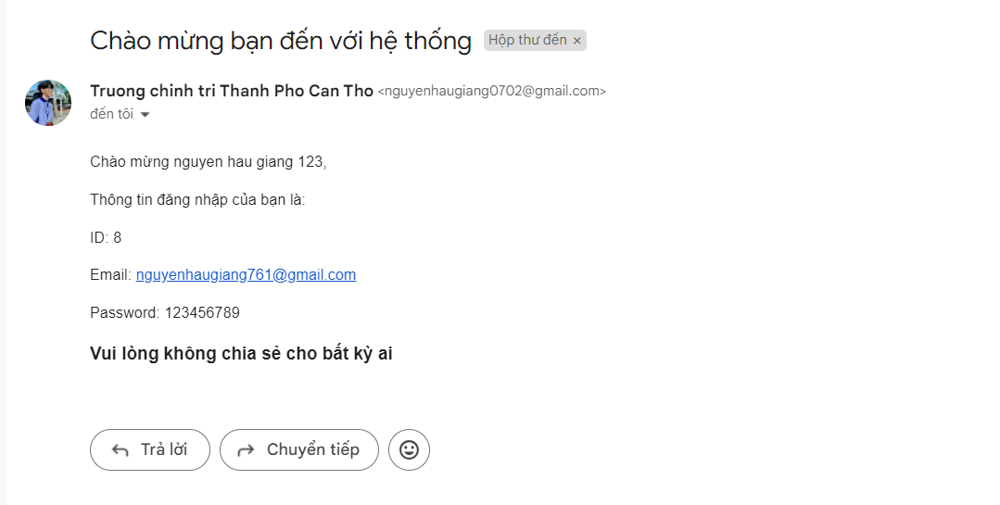

